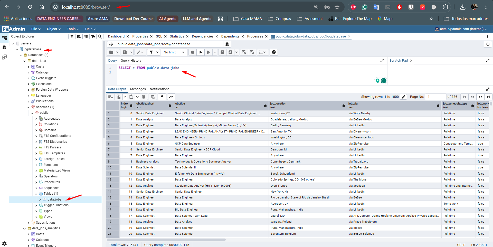
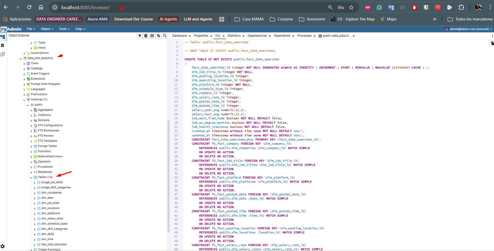

📤🗂️📥 Technical assessment- Data engineer  📤🗂️📥

# Job Data Ingestion Pipeline Instrucctions

This project ingests job data from a local CSV file into PostgreSQL using Docker and `uv`, and creates the 3NF schema/ database for PostgreSQL.

**[↑ Up](README.md)** | **[← Previous](03-ProjectStructure.md)** | **[Next →](05-ConceptualOlapModel.md)**

# ✅ Database Models and Design

- 0 Original database model loaded into PostgreSQL.
- 1 3rd Normal Form (3NF) normalized model.
- 2 Handling semi-structured data (lists and dictionaries): resolving many-to-many relationships using bridge tables.

### - 0 Original database model loaded into PostgreSQL.

For this project, it was defined that the entire solution would be deployed in a **containerized** setup—running all **Python scripts in an isolated container**, and using a **containerized PostgreSQL database** as well.

At the moment, the **raw database** is loaded into a **PostgreSQL container volume**, due to the **technical requirement** stated in the exercise.

Since this could also be considered a **staging dataset/table**, it would have been possible to use **DuckDB** instead, which is **highly efficient for this type of workload** and **faster to implement**. It offers **SQLite-like portability**, but is **significantly faster** and **designed for analytics-oriented use cases**.

Because this is the **first ingestion into a raw database**, it could even be considered a **Bronze layer**. In this step, the fields **`job_skills`** and **`job_type_skills`** are loaded **as text**.

The **SQL structure** of the raw database is the following:

. 

And it is loaded through the container (we also use **pgAdmin**, which is containerized as well, to inspect the database).



For this process, the `ingest_data.py` script was used.


### - 1 3rd Normal Form (3NF) normalized model.

Then, the ETL process loads the tables. Initially, we have the following design to comply with **3NF**:



Regarding the **3NF model and structure**, for each variable we created a mapping indicating where each attribute will be placed:

| Column Name             | Description                                            | Type        | Source           | Destiny `{attributeNewName} -> TableLocation`         | How to Access from fact                                |
| ----------------------- | ------------------------------------------------------ | ----------- | ---------------- | ----------------------------------------------------- | ------------------------------------------------------ |
| `job_title_short`       | Cleaned/standardized job title (e.g., Data Scientist). | Calculated  | From `job_title` | `job_title_short` -> `dim_job_titles`                 | `job_title_id`                                         |
| `job_title`             | Full original job title as scraped.                    | Raw         | Scraped          | Deleted                                               | Deleted                                                |
| `job_location`          | Location string shown in the job posting.              | Raw         | Scraped          | `location` -> `dim_locations`                         | `posting_location_id`                                  |
| `job_via`               | Platform where the job was posted (e.g., LinkedIn).    | Raw         | Scraped          | `platform_name` -> `dim_platforms`                    | `platform_id`                                          |
| `job_schedule_type`     | Type of schedule (Full-time, Contractor, etc.).        | Raw         | Scraped          | `schedule_types_name` -> `dim_schedule_types`         | `schedule_type_id`                                     |
| `job_work_from_home`    | Indicates whether the job is remote (true/false).      | Boolean     | Parsed           | `job_work_from_home` -> `fact_jobs_searched`          | Direct in the FACT                                     |
| `search_location`       | Location used for the search that generated the data.  | Generated   | Bot logic        | `location` -> `dim_locations`                         | `searching_location_id`                                |
| `job_posted_date`       | Date and time when the job was posted.                 | Raw         | Scraped          | `full_date`, `full_hour` -> `dim_date` and `dim_time` | `posted_date_id`, `posted_time_id`                     |
| `job_no_degree_mention` | Indicates if "no degree required" is mentioned.        | Boolean     | Parsed           | `job_no_degree_mention` -> `fact_jobs_searched`       | Direct in the FACT                                     |
| `job_health_insurance`  | Indicates if the posting mentions health insurance.    | Boolean     | Parsed           | `job_health_insurance` -> `fact_jobs_searched`        | Direct in the FACT                                     |
| `job_country`           | Country extracted from the location.                   | Calculated  | Parsed           | `country` -> `dim_locations`                          | `posting_location_id`                                  |
| `salary_rate`           | Indicates if the salary is annual or hourly.           | Raw         | Scraped          | `salary_rate` -> `fact_salarys_searched`              | Direct in the FACT                                     |
| `salary_year_avg`       | Average yearly salary (calculated).                    | Calculated  | Derived          | `salary_year_avg` -> `fact_salarys_searched`          | Direct in the FACT                                     |
| `salary_hour_avg`       | Average hourly salary (calculated).                    | Calculated  | Derived          | `salary_hour_avg` -> `fact_salarys_searched`          | Direct in the FACT                                     |
| `company_name`          | Name of the company posting the job.                   | Raw         | Scraped          | `company_name` -> `fact_companys_searched`            | `company_id`                                           |
| `job_skills`            | (Key) List of skills (e.g., `['Python', 'SQL']`).      | Parsed List | NLP Extracted    | `job_skills` -> `bridge_job_skills`                   | `fact_jobs_searched_id` join `bridge_job_skills`       |
| `job_type_skills`       | (Key) Dictionary grouping skills by type.              | Parsed Dict | NLP Extracted    | `job_type_skills` -> `bridge_skill_categories`        | `fact_jobs_searched_id` join `bridge_skill_categories` |

And the **3NF database structure** is also loaded within the container.

DataJobsAnalytics3NF

### Model Tables

| Table | Type | Description |
|-------|------|-------------|
| `dim_companies` | Dimension | Companies that publish job postings |
| `dim_locations` | Dimension | Geographic locations |
| `dim_platforms` | Dimension | Job platforms (LinkedIn, Indeed) |
| `dim_schedule_types` | Dimension | Schedule types (Full-time, Part-time) |
| `dim_skills` | Dimension | Technical and professional skills |
| `dim_skill_categories` | Dimension | Skill categories |
| `dim_job_titles` | Dimension | Normalized job titles |
| `dim_salary_rates` | Dimension | Salary rate types (annual, hourly) |
| `dim_date` | Dimension | Dates for time-based analysis |
| `fact_jobs` | Fact | Central table for job postings |
| `bridge_job_skills` | Bridge | N:M relationship between jobs and skills |
| `bridge_skill_categories` | Bridge | N:M relationship between skills and categories |

## Design Decisions

###  Why 3NF?

**Third Normal Form (3NF)** was chosen because it:

- **Eliminates redundancy**: Company, location, and skill data is not duplicated
- **Maintains integrity**: Foreign keys (FKs) ensure referential consistency
- **Improves maintainability**: Updating a company automatically affects all related jobs
- **Foundation for OLAP**: A well-designed 3NF model can be easily transformed into a Star Schema


### - 2 Handling semi-structured data (lists and dictionaries): resolving many-to-many relationships using bridge tables.


In the raw layer, we chose to load these fields as **text** (even though PostgreSQL has explicit data types for lists and dictionaries, and they can also be queried similarly to NoSQL-style queries). The relationship handling will be implemented through **bridge tables**.


#### `job_skills` (List)
```python
# Input: "['Python', 'SQL', 'Spark']"
# Output: bridge_job_skills table with one row per skill
```

Decision: Use a bridge table to resolve the many-to-many relationship, enabling:

- Efficient skill-based queries

- Analysis of the most in-demand skills

- Indexing by skill_id

#### `job_type_skills` (Dictionary)

```python
# Input: "{'programming': ['Python'], 'cloud': ['AWS']}"
# Output:
#   - dim_skill_categories with unique categories
#   - bridge_skill_categories relating skills to their categories
```

Decision: Create a separate dimension for categories, enabling analysis by skill type.


 

**[↑ Up](README.md)** | **[← Previous](03-ProjectStructure.md)** | **[Next →](05-ConceptualOlapModel.md)**

